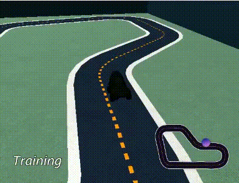

# Chương 1: Giới thiệu về AWSDeepRacer

## 1.1 AWSDeepRacer

### 1.1.1 AWSDeepRacer là gì?
- AWSDeepRacer là một trình mô phỏng đua xe 3D dựa trên đám mây, xe đua quy mô 1/18 hoàn toàn tự trị được điều khiển bằng phương pháp học tăng cường và giải đua xe toàn cầu.
- AWS cung cấp mô hình trong Amazon SageMaker và đào tạo, thử nghiệm và lặp lại một cách nhanh chóng và dễ dàng trên đường đua trong trình mô phỏng đua xe AWS DeepRacer 3D.
- Nó cung cấp cho bạn một cách thú vị và thú vị để bắt đầu với học tăng cường (RL).

### 1.1.2 Các tính năng.
- AWS Sử dụng những services sau để hoạt động và cung cấp chức năng:
	- **Amazon Simple Storage Service**: Lưu trữ model.
	- **AWS Lambda**: Tạo và chạy những thuật toán ‘thưởng’.
	- **AWS CloudFormation**: Tạo chế độ cho những models chạy.
	- **SageMaker**: huấn luyện những models.
	- **AWS RoboMaker**: Tạo ra môi trường để huấn luyện và thử nghiệm.

- Với những services ở trên, AWSDeepRacer giúp người dùng không cần phải bận tâm quá nhiều về việc lưu trữ, hay sử dụng những docker để tạo ra môi trường giả lập: 
	- Dựa trên các container ‎‎Robomaker và Sagemaker, hỗ trợ trên rất nhiều nền tảng thiết lập CPU và GPU.
	- Tập hợp rất nhiều kịch bản cho phép dễ dàng thiết kế model, không cần phải làm mọi thứ từ con số 0.
	- Cho phép các bản mẫu AWS DeepRacer từ nguồn khác; Cho phép tải lên mô hình đã được đào tạo sẵn.
- Bên cạnh đó, AWSDeepRacer còn giúp đỡ trong việc xây dựng model kể cả mô phỏng lẫn vật lý:
	- AWS DeepRacer giúp xây dựng một kết nối wifi dựa phương tiện AWS và AWS DeepRacer Console.
	- AWS DeepRacer có thể chỉnh sửa một số thông tin của phương tiện (tốc độ, độ cân bằng, các góc bánh xe)
	- AWS DeepRacer cũng đưa ra một số templates để xây dựng phương tiện cũng như đường đua vật lý để thử nghiệm ngoài đời thật
- AWSDeepRacer còn bảo dữ liệu người dùng ngăn chặn những xe mô phỏng của mình có thể bị rò rỉ ra ngoài:
	- Dùng xác thực đa yếu tố(MFA) với mỗi người dùng mỗi lần đăng nhập.
	- Dùng SSL/TLS để truy xuất với dữ liệu của AWS.
	- Dùng API và lưu trữ thông tin người đăng nhập bằng AWS CloudTrail.
	- Dùng các cách bảo mật mã hóa.

### 1.1.3 Hạn chế của AWSDeepRacer
- Bởi vì mô phỏng không thể nắm bắt chính xác tất cả các khía cạnh của thế giới thực, các mô hình được đào tạo về mô phỏng có thể không hoạt động tốt trong thế giới thực. Mô phỏng như vậy thường được gọi là khoảng cách hiệu suất mô phỏng-thực (sim2real).
- Các nỗ lực đã được thực hiện trong AWS DeepRacer để giảm thiểu khoảng cách hiệu suất sim2real. Ví dụ: tác nhân được mô phỏng được lập trình để thực hiện khoảng 10 hành động mỗi giây. Điều này phù hợp với tần suất mà phương tiện AWS DeepRacer chạy suy luận, khoảng 10 suy luận mỗi giây. Một ví dụ khác, khi bắt đầu mỗi tập trong huấn luyện, vị trí của đặc vụ được chọn ngẫu nhiên. Điều này tối đa hóa khả năng người đại diện tìm hiểu tất cả các phần của bản nhạc một cách nhất trí.
- Để giúp giảm khoảng cách hiệu suất real2sim, hãy đảm bảo sử dụng màu sắc, hình dạng và kích thước giống nhau hoặc tương tự cho cả bản nhạc mô phỏng và bản nhạc thực. Hãy sử dụng các chướng ngại vật xung quanh đường đua thực. Ngoài ra, hãy hiệu chỉnh cẩn thận phạm vi tốc độ và góc lái của xe để không gian hành động được sử dụng trong huấn luyện phù hợp với thế giới thực. Đánh giá hiệu suất mô hình trong một đường mô phỏng khác với đường đua được sử dụng trong đào tạo có thể cho thấy mức độ chênh lệch hiệu suất thực tế.
- Mẫu xe được trang twitter của AWS:
AWS re:Invent trình chiếu vào 
29/11/2018: 

## 1.2 Học tăng cường (Reinforment Learning)

### 1.2.1 RL là gì?
- RL là một kỹ thuật học máy (ML) tiên tiến giúp học các hành vi rất phức tạp mà không yêu cầu bất kỳ dữ liệu đào tạo được gắn nhãn nào và có thể đưa ra quyết định ngắn hạn trong khi tối ưu hóa cho mục tiêu dài hạn. RL là một cách tiếp cận tập trung vào việc học để hoàn thành mục tiêu bằng việc tương tác trực tiếp với môi trường.
- RL giúp **agent**(ở đây là xe chúng ta muốn huấn luyện) có thể làm được **task**(nhiệm vụ ta giao như hoàn thành đường đua...) bằng cách đưa ra những **action** miễn là **maxize reward** (đạt được hiệu suất tối ưu).

### 1.2.2 Áp dụng cho AWSDeepRacer
- Trong reinforcement learning, các **mô hình AWSDeepRacer** dựa theo mục tiêu được định sẵn mà sẽ tác động với môi trường đường đua để tối đa hóa phần thưởng mà mình sẽ đạt 
- Mục tiêu của RL trong AWSDeepRacer là tìm ra mô hình tối ưu nhất sau khi huấn luyện để có thể đem ra thực nghiệm ngoài thế giới vật lý.

- AWSDeepRacer đưa ra rất nhiều lợi ích khi huấn luyện mô hình với một môi trường mô phỏng sử dụng RL:
	- Mô phỏng có thể ước tính mức độ tiến bộ mà mô hình đã đạt được và xác định thời điểm nó đi chệch hướng để tính toán phần thưởng.
	- Mô phỏng giải phóng người huấn luyện khỏi những công việc tẻ nhạt để thiết lập lại chiếc xe mỗi khi nó đi ra khỏi đường đua, như được thực hiện trong môi trường vật lý.
	- Mô phỏng có thể tăng tốc độ đào tạo.
	- Mô phỏng cung cấp khả năng kiểm soát tốt hơn các điều kiện môi trường, ví dụ: chọn các tuyến đường, bối cảnh và tình trạng xe khác nhau.