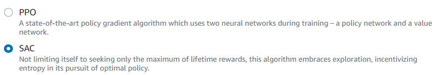
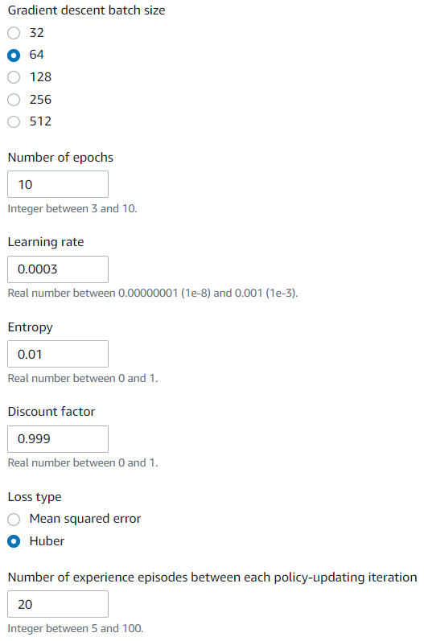
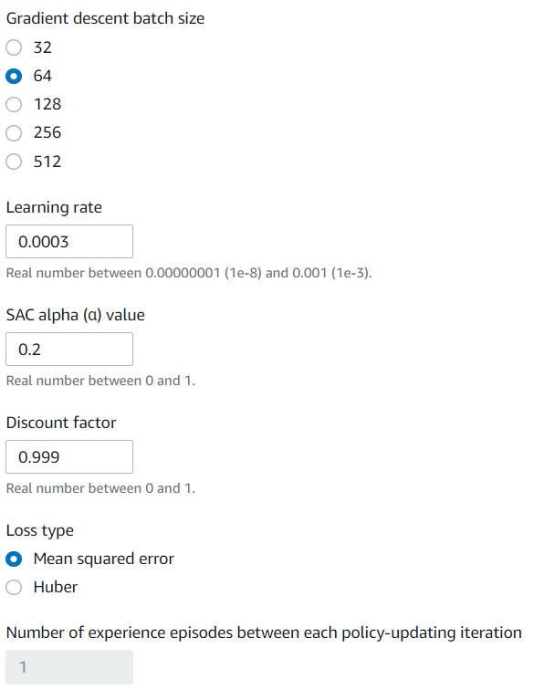

# Chương 2. Xây dựng mô hình.

## 2.1 Điều chỉnh mô hình.

### 2.1.1 Gara.

### 2.1.2 Tùy chỉnh mô hình của mình.
- Camera:

- Ngoại hình:

## 2.2 Xây dựng mô hình.

### 2.2.1 Tên mô hình và loại đường đua.

### 2.2.2 Hình thức đua.

### 2.2.3 Thuật toán huấn luyện và siêu tham số.

- Định nghĩa thuật toán:
	- PPO: Thuật toán tối ưu hóa với policy gần.
	- SAC: Thuật toán tối ưu với policy ngẫu nhiên.
- Lựa chọn giữa hai thuật toán huấn luyện: 

| Proximal Policy Optimization (PPO)  | Soft Actor Critic (SAC) |
| ---------------------------------------------------------------------- | ---------------------------------------------------------------------- |
| Hoạt động trong cả không gian hành động rời rạc và liên tục  | Hoạt động trong không gian hành động liên tục  |
| Học từ những lần thử bây giờ   | Học từ những quan lỗi của mô hình trước  |
| Sử dụng regularization   | Thêm entropy vào mục tiêu tối đa  |

- **Ổn định** (dữ liệu liên tục) so với **Đói dữ liệu** (dữ liệu rời rạc): Thông tin học được bởi các chính sách của thuật toán PPO và SAC trong khi khám phá một môi trường được sử dụng theo cách khác nhau. PPO sử dụng phương pháp học tập theo chính sách có nghĩa là nó học được chức năng giá trị của mình từ những quan sát được thực hiện bởi chính sách hiện tại khám phá môi trường. SAC sử dụng phương pháp học tập ngoài chính sách có nghĩa là nó có thể sử dụng các quan sát được thực hiện bởi quá trình thăm dò môi trường của các chính sách trước đó. Sự cân bằng giữa việc học tập chính sách và học tập đúng chính sách thường là tính ổn định so với hiệu quả dữ liệu. Các thuật toán đúng chính sách có xu hướng ổn định hơn nhưng đói dữ liệu, trong khi các thuật toán ngoài chính sách có xu hướng ngược lại.

- **Khám phá** so với **Khai thác**: Khám phá và khai thác là một thách thức quan trọng trong RL. Một thuật toán nên khai thác thông tin đã biết từ những trải nghiệm trước đó để đạt được phần thưởng tích lũy cao hơn, nhưng nó cũng cần khám phá để có được những trải nghiệm mới có thể được sử dụng để tìm ra chính sách tối ưu trong tương lai. Khi một chính sách được đào tạo qua nhiều lần lặp lại và tìm hiểu thêm về môi trường, chính sách đó trở nên chắc chắn hơn về việc lựa chọn hành động cho một quan sát nhất định. Tuy nhiên, nếu chính sách không đủ khám phá, nó có thể sẽ bám vào thông tin đã được học ngay cả khi nó không ở mức tối ưu. Thuật toán PPO khuyến khích thăm dò bằng cách sử dụng chính quy hóa entropy, điều này ngăn cản các tác nhân hội tụ đến optima cục bộ. Thuật toán SAC đạt được sự cân bằng đặc biệt giữa thăm dò và khai thác bằng cách thêm entropy vào mục tiêu tối đa hóa của nó.

- **Sự hỗn loạn**:
	- Trong ngữ cảnh này, 'entropy' là thước đo độ không chắc chắn trong chính sách, vì vậy nó có thể được hiểu là thước đo mức độ tin cậy của một chính sách khi lựa chọn hành động cho một trạng thái nhất định. Chính sách có entropy thấp rất tự tin trong việc lựa chọn hành động, trong khi chính sách có entropy cao không chắc chắn về việc chọn hành động nào.

	- Chiến lược tối đa hóa entropy của thuật toán SAC có những lợi thế tương tự như việc sử dụng entropy của thuật toán PPO làm bộ điều chỉnh. Giống như PPO, nó khuyến khích khám phá rộng hơn và tránh sự hội tụ đến một điểm tối ưu cục bộ xấu bằng cách khuyến khích tác nhân chọn một hành động có entropy cao hơn. Không giống như điều hòa entropy, tối đa hóa entropy có một lợi thế duy nhất. Nó có xu hướng từ bỏ các chính sách chọn hành vi không thỏa hiệp, đó là một lý do khác khiến thuật toán SAC có xu hướng tiết kiệm dữ liệu hơn PPO.

		- Điều chỉnh lượng entropy trong SAC bằng cách sử dụng siêu thông số SAC alpha. Giá trị entropy SAC alpha tối đa (1,0) cho phép thăm dò. Giá trị tối thiểu (0,0) khôi phục mục tiêu RL tiêu chuẩn và vô hiệu hóa phần thưởng entropy khuyến khích thăm dò. Giá trị alpha SAC tốt để bắt đầu thử nghiệm là 0,5. Điều chỉnh phù hợp khi bạn lặp lại trên các mô hình của mình.

- Hãy thử cả thuật toán PPO và SAC, thử nghiệm với siêu tham số của chúng và khám phá chúng với mỗi lần huấn luyện mô hình.

PPO             |  SAC
:-------------------------:|:-------------------------:
  |  

- Định nghĩa các siêu tham số: 

| Tham số                                | Định nghĩa                                                                                                                                                                                                                                                                                                                                                                                                                                                                                                                                                                      |
|------------------------------------------|----------------------------------------------------------------------------------------------------------------------------------------------------------------------------------------------------------------------------------------------------------------------------------------------------------------------------------------------------------------------------------------------------------------------------------------------------------------------------------------------------------------------------------------------------------------------------------|
| Batch size                               | Số lượng experience xe gần đây được lấy mẫu ngẫu nhiên từ bộ đệm trải nghiệm và được sử dụng để cập nhật trọng số mạng nơ-ron. Nếu bạn có 5120 experience trong bộ đệm và chỉ định kích thước batch là 512, sau đó bỏ qua lấy mẫu ngẫu nhiên, bạn sẽ nhận được 10 batch experience. Lần lượt, mỗi batch sẽ được sử dụng để cập nhật trọng số mạng thần kinh của bạn trong quá trình đào tạo. Sử dụng kích thước batch lớn hơn để thúc đẩy cập nhật ổn định và trơn tru hơn đối với trọng số mạng nơ-ron, nhưng lưu ý khả năng quá trình đào tạo có thể chậm hơn. |
| Number of epochs                         |  Một epoch đại diện cho một lần đi qua tất cả các batch, trong đó trọng số mạng nơ-ron được cập nhật sau mỗi batch được xử lý, trước khi tiếp tục với batch tiếp theo. 10 epochs ngụ ý rằng bạn sẽ cập nhật trọng số mạng nơ-ron, sử dụng tất cả các batch một lần, nhưng lặp lại quá trình này 10 lần. Sử dụng số lượng epoch lớn hơn để thúc đẩy các bản cập nhật ổn định hơn, nhưng mong đợi quá trình đào tạo chậm hơn. Khi kích thước batch nhỏ, bạn có thể sử dụng số lượng epoch nhỏ hơn.                                                                                                           |
| Learning rate                            |  Tốc độ học tập kiểm soát mức độ cập nhật đối với trọng số mạng nơ-ron. Nói một cách đơn giản, khi bạn cần thay đổi trọng số của chính sách của mình để đạt được phần thưởng tích lũy tối đa, bạn nên thay đổi chính sách của mình bao nhiêu. Tỷ lệ học tập lớn hơn sẽ dẫn đến đào tạo nhanh hơn, nhưng nó có thể gặp khó khăn để hội tụ. Tỷ lệ học tập nhỏ hơn dẫn đến sự hội tụ ổn định, nhưng có thể mất nhiều thời gian để đào tạo.                                                                                                                                                                   |
| Exploration                              |  Điều này đề cập đến phương pháp được sử dụng để xác định sự đánh đổi giữa thăm dò và khai thác. Nói cách khác, chúng ta nên sử dụng phương pháp nào để xác định khi nào chúng ta nên ngừng khám phá (lựa chọn ngẫu nhiên các hành động) và khi nào chúng ta nên khai thác kinh nghiệm mà chúng ta đã tích lũy được. Vì chúng tôi sẽ sử dụng không gian hành động rời rạc, bạn nên luôn chọn CategoricalParameters.                                                                                                                                                                                                   |
| Entropy                                  | Một mức độ không chắc chắn, hoặc ngẫu nhiên, được thêm vào phân phối xác suất của không gian hành động. Điều này giúp thúc đẩy việc lựa chọn các hành động ngẫu nhiên để khám phá trạng thái / không gian hành động một cách rộng rãi hơn.                                                                                                                                                                                                                                                                                                                                                                            |
| Discount factor                          | Hệ số chỉ định mức độ đóng góp của phần thưởng trong tương lai vào phần thưởng tích lũy dự kiến. Hệ số chiết khấu càng lớn thì mô hình càng xa để xác định phần thưởng tích lũy mong đợi và đào tạo càng chậm. Với hệ số chiết khấu là 0,9, chiếc xe bao gồm phần thưởng từ thứ tự 10 bước trong tương lai để thực hiện một bước di chuyển. Với hệ số chiết khấu là 0,999, chiếc xe sẽ xem xét phần thưởng từ thứ tự 1000 bước trong tương lai để thực hiện một bước đi. Các giá trị hệ số chiết khấu được đề xuất là 0,99, 0,999 và 0,9999.                                         |
| Loss type                                | Loại tổn thất chỉ định loại hàm mục tiêu (hàm chi phí) được sử dụng để cập nhật trọng số mạng. Các loại lỗi mất bình phương Huber và Trung bình hoạt động tương tự đối với các bản cập nhật nhỏ. Nhưng khi các bản cập nhật trở nên lớn hơn, tổn thất Huber có gia số nhỏ hơn so với tổn thất lỗi trung bình bình phương. Khi bạn gặp vấn đề về hội tụ, hãy sử dụng kiểu mất Huber. Khi độ hội tụ tốt và bạn muốn đào tạo nhanh hơn, hãy sử dụng kiểu mất lỗi bình phương trung bình.                                                                                                      |
| Number of episodes between each training |  Thông số này kiểm soát lượng trải nghiệm mà chiếc xe sẽ có được giữa mỗi lần lặp lại đào tạo mô hình. Đối với các vấn đề phức tạp hơn có nhiều cực đại cục bộ hơn, bộ đệm trải nghiệm lớn hơn là cần thiết để cung cấp nhiều điểm dữ liệu không tương quan hơn. Trong trường hợp này, việc đào tạo sẽ chậm hơn nhưng ổn định hơn. Các giá trị được đề xuất là 10, 20 và 40.                           |

### 2.2.4 Cách thức vận hành của mô hình.

### 2.2.5 Chọn mô hình.

### 2.2.6 Tinh chỉnh các thuật toán thưởng và điều kiện dừng.

## 2.3 Đánh giá hiệu suất mô hình.